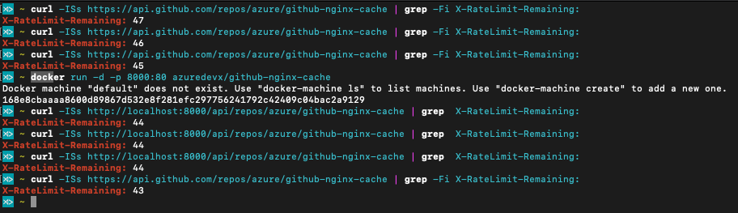

## GitHub nginx cache

This repo contains nginx configuration tuned to sit in front of GitHub endpoints and provide caching functionality. GitHub will not rate-limit [conditional requests](https://developer.github.com/v3/#conditional-requests). The [`proxy_cache_*` nginx directives](http://nginx.org/en/docs/http/ngx_http_proxy_module.html#proxy_cache) force nginx to revalidate any cached content from the upstream server (in this case, GitHub). Revalidation is performed by nginx as a conditional request, therefore it will not reduce api limits. This works for both authenticated and unauthenticated requests.

Here is an example how rate-limiting is mitigated for unauthenticated requests against both https://api.github.com and the cache running on http://localhost:8000.

### Quick Start

    docker run -d -p 8000:80 azuredevx/github-nginx-cache
    curl localhost:8000/api/repos/azure/github-nginx-cache

The GitHub domains are mapped as follows:

| GitHub URL                   | Cache URL                  |
| ---------------------------- | -------------------------- |
| api.github.com/\*            | localhost:8000/api/\*      |
| raw.githubusercontent.com/\* | localhost:8000/raw/\*      |
| codeload.github.com/\*       | localhost:8000/codeload/\* |

### CI/CD

Docker publish 

## Develop

### Build

    docker build .

### Debug

#### Fish

    docker build -t custom-nginx . && docker run -it -p 8000:80  -v (pwd)/nginx-logs:/var/log/nginx custom-nginx
    curl localhost:8000/health/alive

#### Bash

    docker build -t custom-nginx . && docker run -it -p 8000:80  -v $(pwd)/nginx-logs:/var/log/nginx custom-nginx
    curl localhost:8000/health/alive

### Test

    # Run image on localhost:8000
    cd test
    npm ci
    npm run test

## Implementation details

### Github consistency

The cache is designed for the highest possible GitHub consistency such that it ignores any `Cache-Control` headers that GitHub sends and forces nginx to REVALIDATE for every request. A limitation in nginx means that the lowest value for `proxy_cache_valid` directive is one second. This means that two identical requests to GitHub within the space of one second will HIT (return cached response without revalidating) rather than REVALIDATE.

### Cache partitioning

The cache may be used for complicated applications where multiple app and oauth tokens are being used to access GitHub. The default behaviour in this case is to parition the cache by token. This means that a request with token A will not leverage any cached content from requests using token B.

This behaviour is for the following reasons.

1. Security - there are edge cases in which using two tokens within one second of each other could cause a response to be leaked to the second request even if the second token was not allowed to access the resource.
1. Prevent cache churn - if the cache was not partitioned, multiple requests to one api route with different tokens may cause the cache to be evacuated unnecessarily if these tokens have different access permissions.

There may be cases however where this behaviour needs to be overridden at the discretion of the client. For example when using a GitHub app, the token may expire every hour or so in which case the default behaviour would be for the cache to reset every hour which is not desirable.

By setting **X-Cache-Key** header, the cache [will be paritioned](nginx-config/cache_key_logic.conf) on this arbitrary string rather than the token.

# Contributing

This project welcomes contributions and suggestions. Most contributions require you to agree to a
Contributor License Agreement (CLA) declaring that you have the right to, and actually do, grant us
the rights to use your contribution. For details, visit https://cla.microsoft.com.

When you submit a pull request, a CLA-bot will automatically determine whether you need to provide
a CLA and decorate the PR appropriately (e.g., label, comment). Simply follow the instructions
provided by the bot. You will only need to do this once across all repos using our CLA.

This project has adopted the [Microsoft Open Source Code of Conduct](https://opensource.microsoft.com/codeofconduct/).
For more information see the [Code of Conduct FAQ](https://opensource.microsoft.com/codeofconduct/faq/) or
contact [opencode@microsoft.com](mailto:opencode@microsoft.com) with any additional questions or comments.
